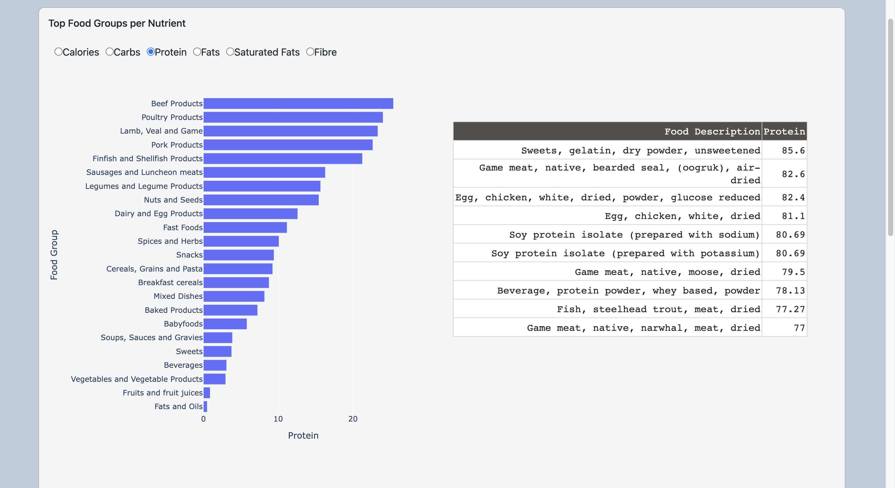
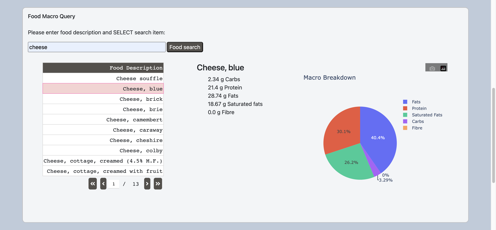
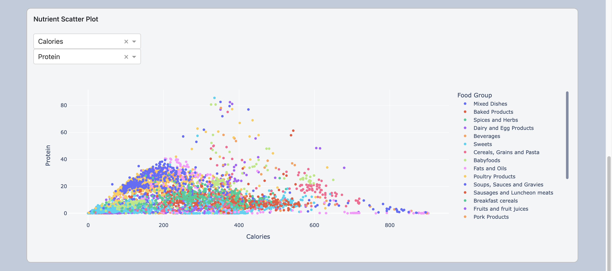

# Food Dashboard

A dashboard illustrating macronutrient data taken from the 2015 Canadian Nutrient File. 
 
[Food Dashboard](https://food-dashboardx.herokuapp.com/)

## Overview

### Top Food Groups:
A bar chart displaying food groups ranked by highest average of selected
macronutrient, along with a table showing the top 10 foods of that particular
food group.

### Macro Query:
A querying tool that allows the user to look up the macronutrient profile 
of a food item.

### Macronutrient scatter plot
A scatter plot illustrating relationships between 2 macronutrients along with
their food groups.

